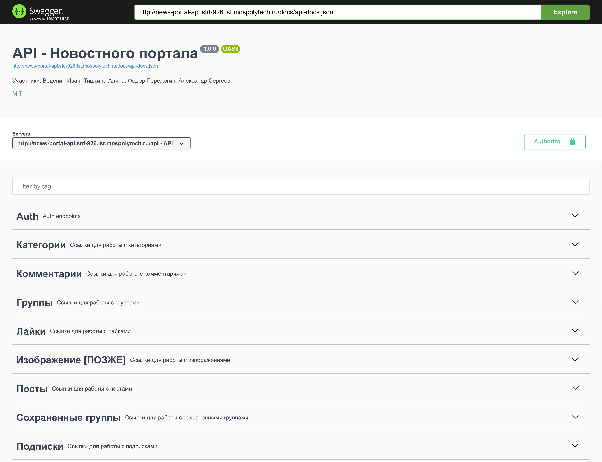

<h1 align="center">  API Новостного портала</h1>

<p align="center">
<a href="https://travis-ci.org/laravel/framework"></a>
<a href="https://packagist.org/packages/laravel/framework"></a>
</p>

### Функционал

* ***Регистрация*** / ***Авторизация*** / ***Редактирование личных данных***.
* ***Создание групп*** / ***Сохранение групп***.
* ***Создание категорий***.
* ***Публикация новостей***.
* ***Публикация комментариев***.
* ***Оценка публикаций***.
* ***Подписка на группы***.

### Экран *"SWAGGER"*




### Технологии

* Язык: **PHP**
* Технологии: **Laravel, L5-swagger, Sanctum**

## Установка

***Первый этап*** *(Скопировать репозиторий)*
```git
git clone https://github.com/l1ve4code/wp-news-portal-api
```

***Второй этап*** *(Установить зависимости)*
```composer
composer install
```

***Третий этап*** *(Запустить сервер)*
```php
php artisan serve
```

Модули в проекте:

- `php` - язык программирования. *Версия **8.0***
- `darkaonline/l5-swagger` - фреймворк для описания, документирования и визуализации REST API. *Версия **8.3***
- `guzzlehttp/guzzle` - HTTP-клиент. *Версия **7.2***
- `laravel/sanctum` - система аутентификации для SPA. *Версия **2.14***

## Автор

* Telegram: **[@live4code](https://t.me/live4code)**
* Email: **steven.marelly@gmail.com**
